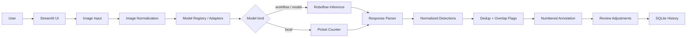

# AI Inventory Counter

**Proof of Concept** — Streamlit app that estimates **visible** inventory items in photographs using AI object detection (Roboflow YOLO-World), with human review before save. Multi-user, with administrator-managed accounts and per-user inventory history.

**Not production-ready.** Counts are assistive drafts. Review detections before treating them as official inventory. The authentication layer is a local proof of concept — see [`docs/SECURITY_MODEL.md`](docs/SECURITY_MODEL.md).

**GitHub:** [https://github.com/Hariram0001/AI_Inventory_Counter](https://github.com/Hariram0001/AI_Inventory_Counter)  
**Entrypoint:** `app.py`  
**Cloud host:** Streamlit Community Cloud (also Railway via `start.sh`)  
**Python:** 3.11 (`.python-version`)

> Closely stacked, partially hidden, distant, or overlapping objects may be missed. YOLO-World may detect an entire structure as one object depending on the photo and prompt. **Human review is required.**

---

## Overview

| Audience | Start here |
|----------|------------|
| Stakeholder | [Demo flow](#demo-flow), [POC capabilities](#poc-capabilities), [Current limitations](#current-limitations), [`docs/STAKEHOLDER_DEMO_SCRIPT.md`](docs/STAKEHOLDER_DEMO_SCRIPT.md) |
| Developer | [Architecture](#architecture), [Local setup](#local-setup), [Testing](#tests-and-validation) |
| Deployer | [Deployment](#deployment), [Configuration](#configuration-and-environment), [`docs/STREAMLIT_DEPLOYMENT.md`](docs/STREAMLIT_DEPLOYMENT.md) |
| Administrator | [Accounts and access](#accounts-roles-and-access), [`docs/ADMIN_GUIDE.md`](docs/ADMIN_GUIDE.md) |
| User bringing an OpenRouter key | [`docs/OPENROUTER_BYOK.md`](docs/OPENROUTER_BYOK.md) |

**Guides:** [Authentication and roles](docs/AUTHENTICATION_AND_ROLES.md) ·
[Administrator guide](docs/ADMIN_GUIDE.md) ·
[OpenRouter BYOK](docs/OPENROUTER_BYOK.md) ·
[Security model](docs/SECURITY_MODEL.md) ·
[Streamlit deployment](docs/STREAMLIT_DEPLOYMENT.md)

---

## Problem

Manual photo-based inventory counting is slow and hard to audit. This POC demonstrates an end-to-end assistive path: choose inventory → add photos → run AI detection → review numbered markers → save a history record.

---

## POC capabilities

| Area | Status |
|------|--------|
| Login-first access with administrator-created accounts | Implemented |
| Administrator console (users, samples, model access, connectivity, audit) | Implemented |
| Per-user Inventory History | Implemented |
| OpenRouter VLM Detector via bring-your-own-key | Implemented |
| Model access policies, cost confirmation, daily quotas | Implemented |
| Wizard: Setup → Photos → Analyze → Running → Review & Save | Implemented |
| Preset inventories + Custom Item prompts | Implemented |
| Home **Get Started** / **Try a Sample** (verified samples) | Implemented |
| Home **Shape Detection** (Testing Phase — local OpenCV circles) | Implemented |
| Dynamic YOLO-World prompts (no silent fence fallback) | Implemented |
| Upload, camera, built-in samples | Implemented |
| Single Model + Compare Models (when ≥2 validated peers) | Implemented |
| Validated Model Catalog | Implemented |
| Detection Benchmark (single + batch) | Implemented |
| Numbered markers / boxes / both | Implemented |
| SQLite Inventory History + CSV export | Implemented |
| Demo Mode (mock responses) | Implemented |
| SSO / OIDC, MFA, durable cloud storage | **Not implemented** (see [security model](docs/SECURITY_MODEL.md)) |

Acceptance checklist: `docs/POC_ACCEPTANCE_CHECKLIST.md`

---

## Demo flow

1. Sign in (the app opens on a login screen; the first administrator comes from
   [bootstrap configuration](#accounts-roles-and-access)).
2. **Try a Sample → Fence Panel** (or **Get Started**).
3. Confirm photos are loaded → **Analyze** → **YOLO-World** → **Run Analysis**.
4. Review numbered detections → adjust if needed → **Save Result**.
5. Open **Inventory History** — each account sees only the counts it saved.
6. Optional: Fence Panel **Compare Models** (YOLO-World + Local Picket Counter).
7. Optional (admin): **Open administrator console** → Users, Model Access,
   Audit Log.
8. Optional (admin): **API Keys** → verify an OpenRouter key → **Model Access**
   → enable OpenRouter VLM Detector → users can run it without seeing the key.

Stakeholder script: `docs/STAKEHOLDER_DEMO_SCRIPT.md`

**Note:** A built-in Cardboard Boxes sample is not included yet. Boxes inventory works with uploaded photos; use Fence Panel for the verified sample journey.

---

## What is implemented today

Verified against the current codebase:

| Area | Status |
|------|--------|
| Streamlit wizard (Setup → Photos → Analyze → Running → Review & Save) | Implemented |
| Dynamic inventory profiles + Custom Item prompts | Implemented |
| Dynamic YOLO-World `class_names` injection (no silent fence fallback) | Implemented |
| Detection Benchmark (Settings → AI Configuration) | Implemented |
| Upload + camera + built-in sample library | Implemented |
| YOLO-World via Roboflow Workflow (`custom-workflow`) | Implemented |
| OpenRouter VLM Detector via Roboflow Workflow, admin-managed key | Implemented |
| Local Picket Counter (classical NumPy/PIL) | Implemented (optional) |
| Single Model and Compare Models (2–3 peers) | Implemented |
| Numbered markers / boxes / both, without re-inference | Implemented |
| Review exclude/include, label edit, manual markers (X/Y) | Implemented |
| SQLite history + CSV download | Implemented |
| Login gate, Argon2id passwords, lockout, forced change for new accounts | Implemented |
| Password complexity rules | **Disabled by design** (see [security model](docs/SECURITY_MODEL.md)) |
| Administrator console + audit log | Implemented |
| Per-user history scoping (private to each account) | Implemented |
| Model access policies, cost confirmation, per-user daily quotas | Implemented |
| Model Catalog (workspace sync, foundation list, public models UI) | Implemented |
| Demo Mode (`sample_responses/mock_detection.json`) | Implemented |
| Photo crop / count-region preparation UI | **Not wired** (module exists, unused by `app.py`) |
| Experimental Consensus as a first-class Analyze mode | **Settings-only / not shown in Analyze UI** |
| OpenCV / local PyTorch detection | **Not used** |
| SSO / OIDC, MFA, email delivery, encryption at rest | **Not implemented** |

---

## Accounts, roles and access

The app is login-first: an unauthenticated visitor sees only a sign-in form.
There is no public self-registration and no default account — administrators
create every user.

| Role | Can do |
|------|--------|
| `user` | Run analyses, review and save counts, see **their own** history, manage their own OpenRouter key and password |
| `admin` | All of the above, plus the administrator console. History stays private to each account. |

### First administrator

Set these once, in `.env` locally or Streamlit Secrets in the cloud, before the
first launch. They are used only while the `users` table is empty:

```bash
BOOTSTRAP_ADMIN_USERNAME=admin
BOOTSTRAP_ADMIN_PASSWORD=admin
BOOTSTRAP_ADMIN_EMAIL=admin@example.com
```

The account is usable immediately — no forced password change. If the variables
are missing, the login page says so and nothing is created.

> **The default is `admin`/`admin`.** That is a demo convenience, not a safe
> configuration. Anyone who reaches the URL can sign in as an administrator, so
> choose a real password before exposing this build anywhere public.

### Passwords and sessions

Argon2id hashing and **no complexity policy at all** — any non-empty password is
accepted. Lockout still applies after 5 failed attempts for 15 minutes, along
with 30-minute idle and 12-hour absolute session timeouts, and immediate session
invalidation on deactivation, deletion or password reset.

Administrators cannot read passwords. Reset generates a temporary password
shown exactly once, and accounts an administrator creates must set their own
password at first sign-in.

Full detail: [`docs/AUTHENTICATION_AND_ROLES.md`](docs/AUTHENTICATION_AND_ROLES.md)
and [`docs/ADMIN_GUIDE.md`](docs/ADMIN_GUIDE.md).

### OpenRouter (administrator-managed key)

Only administrators enter an OpenRouter API key (**API Keys** page). It is
verified with a free `GET /api/v1/key` metadata call, then stored for the
deployment. Regular users never see that page or the key.

When an administrator enables the OpenRouter VLM Detector under **Model
Access**, signed-in users can select and run it — the deployment key is used
under the hood. Runs bill the administrator's OpenRouter account and also
consume Roboflow Workflow credits. Daily per-user quotas still apply (25 by
default).

Full detail: [`docs/OPENROUTER_BYOK.md`](docs/OPENROUTER_BYOK.md).

---

## Technology stack

Only technologies that appear in dependencies or source are listed.

| Technology | Role | Where | Required? |
|------------|------|-------|-----------|
| **Python 3.11** (`.python-version`; 3.10–3.12 OK locally) | Runtime | Entire project | Required |
| **Streamlit 1.59.2** | Full UI, session state, file/camera widgets, progress | `app.py`, `catalog_ui.py`, lazy import in `ui_helpers.py` | Required |
| **Roboflow `inference-sdk` 1.2.6** | Hosted workflow / model inference (`InferenceHTTPClient`) | `detector.py` (lazy import) | Required for live Roboflow; optional in Demo Mode or local-only runs |
| **Roboflow Management API** (via `requests`, transitive) | Fetch published workflow specs for prompt injection; workspace catalog sync | `detector.py`, `model_catalog.py` | Required for prompt-driven YOLO-World and workspace sync |
| **Pillow 11.3.0** | EXIF orientation, RGB convert, resize, tiles, annotation draw | `image_processing.py`, `picket_counter.py`, `sample_images.py`, others | Required |
| **NumPy 2.3.5** | Box sanitizing; classical picket peak detection | `image_processing.py`, `picket_counter.py`, `image_quality.py` | Required |
| **pandas 2.3.3** | History / comparison / registry tables; CSV export | `app.py` | Required |
| **SQLite** (`sqlite3`) | Reviewed counts, users, audit events, model policies, samples | `database.py` → `DATA_DIR/inventory_counts.db` | Required |
| **argon2-cffi** | Argon2id password hashing and verification | `security.py` | Required (no sign-in without it) |
| `python-dotenv` 1.2.2 | Load local `.env` | `config.py` | Required |
| **`requests`** | Roboflow Management API / catalog sync | `detector.py`, `model_catalog.py` | Required |
| **Streamlit secrets** | Cloud credentials when `st.secrets` is available | `config._secret_get` | Optional (Cloud) |
| **pytest 8.4.2** | Offline unit / contract tests | `tests/` | Development |
| **hashlib** | Image content hashes, inference cache keys, stable detection IDs, colors | `app.py`, `image_processing.py`, `detection_ids.py`, `detection_viz.py` | Required |
| **pathlib** | Cross-platform project-relative paths | Throughout | Required |
| **Custom CSS** | Cards, stepper, inventory tiles, marker chips, metrics | `ui_helpers.inject_css()`, `catalog_ui.py` | Required for current UI look |
| **Streamlit session state** | Wizard photos, form, results, review edits, cache | `app.py` / `ui_helpers.py` | Required |
| **JSON** | `models.json`, sample `manifest.json`, catalog files, `AIC_META` in notes | Multiple modules | Required |
| **Git** | Source of truth for deploy + bundled sample images | `.gitignore` exceptions under `assets/sample_images/` | Required for durable samples |
| **Railway + Nixpacks** | Documented deploy path (`railway.json`, `start.sh`) | Deploy config | Optional (one supported host) |

**Not used:** OpenCV, Docker (no Dockerfile), Streamlit `st.secrets`, local Ultralytics/YOLO weights, PyTorch.

---

## Architecture



### Module map

```text
Streamlit (app.py — login gate / dashboard / 4-stage wizard / settings)
  ├─ auth.py                              provider interface, AuthenticatedUser, bootstrap
  ├─ auth_session.py                      session state namespaces, timeouts, BYOK key
  ├─ auth_ui.py                           login, forced change, user menu, account page
  ├─ user_store.py                        users, audit events, policies, usage counters
  ├─ security.py                          Argon2id hashing, password policy, redaction
  ├─ admin_console.py                     administrator console tabs
  ├─ admin_samples.py                     admin-uploaded sample validation and storage
  ├─ model_access.py                      policy + quota decisions for model selection
  ├─ openrouter.py                        BYOK key verification, cost notice, availability
  ├─ ui_helpers.py + app_constants.py     CSS, toolbar, stepper, nav, stage constants
  ├─ inventory_config.py                  Fence Panel gating + recommended-model resolution
  ├─ sample_images.py                     assets/sample_images/manifest.json library
  ├─ image_processing.py                  EXIF → RGB → PreparedImage, tiles, annotation
  ├─ model_registry.py + models.json      registry load/save/validate
  ├─ model_catalog.py + catalog_ui.py     catalog browser + workspace sync
  ├─ model_adapters.py                    adapter contract → ModelInferenceResult
  ├─ detector.py                          inference-sdk, parsing, per-image pipeline
  ├─ benchmark.py / benchmark_ui.py       Detection Benchmark metrics, storage, UI
  │     ├─ picket_counter.py              local classical fence-picket counter
  │     └─ overlap.py                     IoU/IoS, NMS/NMM/Conservative, flags
  ├─ detection_ids.py + detection_viz.py  stable IDs, colors, marker numbers
  ├─ review_navigation.py + confidence_ui.py + comparison_helpers.py
  ├─ database.py                          SQLite + versioned migrations (schema v5)
  └─ config.py                            .env + inventory profiles + limits + session policy

Present but not wired into the Analyze UI:
  photo_preparation.py, image_quality.py
```

### Runtime data flow (one photo × one model)

1. Staged image bytes in `st.session_state.uploaded_images`
2. `load_image_from_bytes` → `PreparedImage` (EXIF, RGB, optional resize if max side &gt; `MAX_INFERENCE_DIMENSION`)
3. Session `inference_cache` lookup (SHA-256 over image hash + model + prompt + thresholds + tiling + dedup)
4. `get_adapter(model).predict(...)` → `run_inference_on_prepared_image`
5. Temp JPEG written for the SDK; workflow / direct model / local path runs
6. `normalize_predictions` → detections; optional tile coordinate translation
7. Deduplicate + mark overlap/occlusion; annotate; wrap as `InferenceResult` / `ModelInferenceResult`
8. Review re-annotates from original bytes (style changes do **not** re-call Roboflow)
9. Save writes SQLite + `AIC_META=` JSON appended to `notes`

---

## User workflow

### Views

| View | Purpose | Who sees it |
|------|---------|-------------|
| **Login** | Sign-in form; the only view before authentication | Everyone signed out |
| **Force password change** | Blocks everything until a new password is set | Users flagged for change |
| **Welcome** | Dashboard + **Get Started** (opens the inventory wizard) and **Shape Detection** (Testing Phase) | All signed-in users (when policy allows) |
| **Shape Detection** | Local OpenCV circle detection — separate from inventory history | Active users when enabled |
| **Wizard** | Four stages below | All signed-in users |
| **Settings** | AI Configuration · Inventory History · Diagnostics | All signed-in users |
| **Account** | Profile and password change | All signed-in users |
| **API Keys** | OpenRouter key verification and removal | All signed-in users |
| **Administrator console** | Users · Samples · Model Access · Experimental Features · Connectivity · Audit Log · Storage | Administrators only |

### Wizard stages

| Stage | What the user does |
|-------|--------------------|
| **Inventory Setup** | Choose yard; click **Fence Panels** (other inventory types show as Coming Soon). Photo relationship is fixed to *Separate inventory areas*. |
| **Add Photos** | Upload, camera, and/or Sample Images; continue when ≥1 photo is staged |
| **Analyze** | Choose Single Model or Compare Models; run analysis; continue to review |
| **Review & Save** | Inspect markers, adjust count, **Save Inventory** |

There is no separate “Save” stage — save lives on the Review screen.

---

## Image inputs

All sources share `_add_image_bytes` → `validate_upload` → `_image_meta` → `uploaded_images`.

### Upload

- Types: JPG / JPEG / PNG (multiple files)
- Cap: `MAX_UPLOAD_BYTES` (default 25 MB per file)
- Corrupt / wrong-type files are rejected with an error message

### Camera

- `st.camera_input` → pending preview → **Add This Photo** or **Retake / Discard**
- Filename pattern: `camera_YYYY-MM-DD_HHMMSS.jpg`

### Built-in samples

- Tab **Sample Images** loads enabled Fence Panel entries from `assets/sample_images/manifest.json`
- Card **Select** does not add; use **Add Selected Photos** or Preview → **Add This Photo**
- `source="sample"` and `sample_id` are stored on the image meta object

### Canonical image meta fields

```text
id, name, source, mime_type, data, bytes, width, height,
size_bytes, content_hash, captured_at [, sample_id]
```

`id` is the first 16 hex characters of the SHA-256 `content_hash`. Duplicate content returns: **This image is already included.**

Uploads are **not** written to a permanent uploads folder; they live in session memory for the run.

---

## AI and detection pipeline

### Live Roboflow path (YOLO-World workflow)

Default live model in `models.json`:

- **Name:** YOLO-World  
- **Kind:** `workflow`  
- **Workspace / workflow:** `hariram-s-mzhvc` / `custom-workflow`  
- **Image input:** `image`  
- **Prompt parameter name in registry:** `class_names`  

**Important implementation detail:** the published workflow is treated as image-only at runtime. When a detection prompt is present, the app:

1. Fetches the published workflow specification from the Roboflow Management API  
2. Injects `class_names` into YOLO-World-related steps  
3. Runs `client.run_workflow(specification=..., images=..., use_cache=False)`  

**Dynamic prompt execution is verified** for inventory analysis: runs use
`published_specification_with_prompt` after injecting `class_names` into the YOLO-World
step. Dynamic runs **do not** fall back to the unmodified published defaults (`wood fence`).

Empty-draft fallback (`workflow_id` → `[{}]` → published spec) remains only when **no**
dynamic prompts were requested (legacy / default-spec probes).

Default Fence Panel queries (from `inventory_profiles.json`):  
`fence panel`, `wooden fence panel`, `privacy fence panel`.

**Object-level quality still needs benchmarking.** Prompt wording affects results.
YOLO-World may detect a whole structure (for example one box around an entire fence)
instead of individual countable units. Image-specific benchmark metrics are not
universal model accuracy. Specialized inventory may still require custom training.

### Detection Benchmark

Settings → **AI Configuration** → **Detection Benchmark** provides an isolated
validation workflow (does not modify the active inventory wizard).

**Modes**

- **Single Image** — original one-image / up to three prompt sets workflow  
- **Batch Benchmark** — multiple images × prompt sets × confidence thresholds  

**Single Image**

1. Select inventory (or Custom Item) and edit up to **3** prompt sets for the test  
2. Choose a built-in sample or upload a dedicated image  
3. Enter expected ground-truth count and optional object definition  
4. Run YOLO-World independently per prompt set  
5. Inspect the annotated image; label detections (correct / FP / wrong class / duplicate / ignore)  
6. Enter missed objects; review precision, recall, and count error for **this image**  
7. Save results to `data/benchmarks.json` (ephemeral on Streamlit Community Cloud)  
8. Optionally promote a selected prompt set into `inventory_profiles.json` (with backup)

**Batch Benchmark**

- Up to **20** images (samples and/or uploads), deduped by content hash  
- Per-image expected counts in a compact table (manifest GT prefills when verified)  
- Fixed threshold or sweep (default `0.10–0.30`, max 8 values)  
- Planned runs = images × enabled prompt sets × thresholds (confirm if > 30)  
- Result cache by image hash + prompts + threshold + model/workflow  
- Comparison matrix + ranking objectives; promote prompts **and** default confidence only explicitly  
- Export JSON / CSV; sessions in `data/benchmark_sessions.json`  

**Threshold note (one-image evidence, not universal):** a valid-looking fence detection
was ~24.9%. Threshold **0.25** removed it; **0.20** retained it. Lowering the threshold
can increase false positives.

### How to validate a new inventory type

1. Add or select an inventory profile  
2. Upload a representative image  
3. Enter the expected count  
4. Test up to three prompt sets  
5. Inspect numbered boxes  
6. Record false positives and missed objects  
7. Save the benchmark  
8. Promote the best prompt set only after several images  

### Local Picket Counter

- Classical tip/peak silhouette detector (`picket_counter.py`)
- Best suited to pointed / dog-ear pickets; can refuse flat privacy tops
- Fixed reported confidence `0.55`; class `fence-picket`
- No Roboflow API key required when running local-only

### Inference modes (Advanced Settings)

| Mode | Behavior |
|------|----------|
| **Whole Image** | One inference call on the prepared image |
| **Tiled** | Grid tiles with overlap; detections mapped back to original coordinates |
| **Thorough Multi-Scale** | Whole image + additional tile scales (API call caps apply) |

Limits: `MAX_TILES_PER_IMAGE` (60), `MAX_API_CALLS_PER_IMAGE` (60).  
Note: `estimate_api_calls()` exists in `detector.py` but is **not** bound to a confirm UI in the current Analyze page.

### Deduplication strategies

Configured in Advanced Settings: **Conservative** (default), **NMS**, **NMM**, **None/debug**.

Review can show strategy comparison counts (Raw / NMS / NMM / Conservative) computed on the same raw set.

### Zero detections vs failures

- Genuine empty predictions → valid zero result UI  
- Empty workflow draft / API / config errors → failure UI (not labeled as count 0 success)  
- Compare Models: a failed peer shows status such as Timeout / Network failure / Failed with counts displayed as `—`, not fake zeros  

### Photo preparation

`photo_preparation.py` (crop, rotate, include/exclude regions) and `image_quality.py` exist and have tests, but **Analyze uses the raw staged bytes**. There is no Preview & Prepare step in the current Add Photos flow.

---

## Model registry and comparison

### Registry source of truth

- File: `models.json` (atomic save with `.bak`; API keys are stripped before write)
- Catalog overlay: `data/model_catalog.json` (Settings → Model Catalog)
- Analysis selector uses **enabled, live-validated, inventory-compatible** object detectors with an implemented adapter
- Demo fixtures are excluded when `DEMO_MODE=false`
- API keys are never stored in the catalog

### YOLO-World vs fixed-class models

- **YOLO-World** is the primary generic **prompt-driven** Foundation model (`custom-workflow`). Inventory prompts are injected into YOLO-World `class_names`. The model name stays **YOLO-World**; inventory is shown separately (e.g. Model: YOLO-World · Detecting: Boxes).
- **Workspace** and **public** object-detection models are usually **fixed-class**: they only detect their trained classes. They do **not** accept arbitrary Custom Item prompts. Map trained classes to inventory profiles locally before enabling.
- **Discovery ≠ live validation.** Refresh Workspace / metadata validation marks entries as Metadata only until a dedicated live Test succeeds.

### Current registry entries (summary)

| Model | Kind | Enabled | Role |
|-------|------|---------|------|
| YOLO-World | workflow | Yes (default) | Live prompt-driven Roboflow counting |
| Local Picket Counter | local | Yes | Optional classical Fence Panel peer |
| Demo Fence Detector | model | No | Demo-only fixture |
| Playground GPT-5.6 Luna … | workflow | No | Present but disabled / needs configuration |

Foundation Models lists only **YOLO-World** as Ready. Non-counting capabilities (CLIP, OCR, captioning) appear under **Future Capabilities** (informational only) and are never selectable for counting.

### Single Model

- Select exactly one compatible validated model → **Run Analysis**
- Shows Inventory, Model, and Detection terms (for prompt-driven models)

### Compare Models

- Multiselect **2–3** compatible **validated** peers (`COMPARE_MIN_MODELS=2`, `COMPARE_MAX_MODELS=3`)
- Peers: enabled, live-validated, non-demo `workflow` / `model` / `local` adapters compatible with the inventory
- Does **not** invent fake models to enable the button
- Button: **Run Comparison** (disabled until ≥2 selected)
- If only one peer exists:  
  *“Only one compatible validated model is currently available. Add and validate another object-detection model to use comparison.”*
- Sequential independent execution: every photo × every selected model  
  Caption example: `2 photos × 2 models = 4 analysis runs`
- Progress: `Running model 2 of 3 on image 1 of 2` and `Running: {model name}`
- Review: model tabs (optional side-by-side when exactly two models); **Use This Result** sets the accepted output for save (never auto-picks highest count)
- Factual labels only (Fastest, Most detections, Highest average confidence, Fewest warnings) — **not** accuracy claims

With the default enabled set, Compare is available for **Fence Panel** using **YOLO-World + Local Picket Counter**. For inventories such as Boxes, the POC may initially have only YOLO-World until a second model is registered and live-validated.

### How to add a second model

1. Train a workspace object-detection model or select a suitable public model ID.
2. **Refresh Workspace** or register the model ID under Public Models.
3. Inspect its trained classes.
4. Map compatible inventory profiles (not Custom Item unless open-vocabulary is proven).
5. Run a **live Test** (zero detections can still prove executability).
6. **Enable** the model after status is Ready.
7. Open **Compare Models** on a compatible inventory.

---

## Review, markers, confidence, and save

### Visualization

- Styles: Numbered Markers · Bounding Boxes · Both  
- Switching styles re-annotates locally; **does not rerun inference**
- Marker numbers sort by `(center_y, center_x, detection_id)`
- Colors are stable per detection ID (palette in `detection_viz.py`)

### Confidence

- Shown as **Model confidence** (percent + High / Medium / Low bands)
- Bands are UI-only (`confidence_ui.py`); they are **not** automatic exclude thresholds
- Pipeline confidence filter default: **0.25** (slider in Advanced Settings)

### Editing

- Exclude / include detections; edit class labels  
- Manual markers via typed X/Y (no click-to-place canvas in this POC)  
- Adjustments: false positives, missed items, or direct reviewed count + notes  
- Filters and pagination for large detection lists (`PAGE_SIZE = 15`)

### Save

- Table: `inventory_counts` in `DATA_DIR/inventory_counts.db`
- New rows always record `user_id` and `username`; each signed-in account sees
  only its own history — never another user's, and never unowned legacy rows
- Reviewed count:  
  `direct` if set, else `max(0, visible_detections - false_positives + missed)`
- Notes may include `AIC_META=` JSON with comparison mode, selected model keys/names, per-model summaries, chosen review model, final detections, and saved count  
- Older rows without `AIC_META` still load in History

---

## Configuration and environment

Copy `.env.example` → `.env`. **Never commit real API keys.**

| Variable | Default | Purpose |
|----------|---------|---------|
| `ROBOFLOW_API_KEY` | empty | Live Roboflow authentication (never displayed) |
| `DEMO_MODE` | `false` in code; `true` in `.env.example` | Use `sample_responses/mock_detection.json` instead of live calls |
| `DATA_DIR` | `./data` | SQLite + catalog + debug artifacts |
| `ROBOFLOW_API_URL` | `https://serverless.roboflow.com` | Inference HTTP endpoint |
| `MAX_UPLOAD_BYTES` | 25 MB | Per-file upload limit |
| `MAX_INFERENCE_DIMENSION` | 2048 | Max side before LANCZOS resize |
| `MAX_TILES_PER_IMAGE` | 60 | Tile hard cap |
| `MAX_API_CALLS_PER_IMAGE` | 60 | Call hard cap for multi-scale/tiled runs |
| `API_CALL_CONFIRM_THRESHOLD` | 30 | Defined in config; **no Analyze confirm UI currently** |
| `INFERENCE_TIMEOUT_SECONDS` | 120 | Defined in config; **not applied to SDK calls in current code** |
| `BOOTSTRAP_ADMIN_USERNAME` | empty | First-admin bootstrap; used only while no users exist |
| `BOOTSTRAP_ADMIN_PASSWORD` | empty | One-time password, replaced at first sign-in |
| `BOOTSTRAP_ADMIN_EMAIL` | empty | Optional email for the bootstrap admin |
| `SESSION_IDLE_TIMEOUT_MINUTES` | 30 | Sign-out after inactivity |
| `SESSION_ABSOLUTE_TIMEOUT_HOURS` | 12 | Hard session lifetime |
| `OPENROUTER_MODELS_ENABLED` | `true` | Set false to hide OpenRouter models from everyone |
| `OPENROUTER_WORKFLOW_ID` | `playground-gpt-5-6-luna-od` | Roboflow workflow backing the VLM detector |
| `OPENROUTER_KEY_VERIFY_URL` | `https://openrouter.ai/api/v1/key` | Key metadata endpoint used for verification |

Helpers never print the raw key (`masked_api_key_status()` → Configured / Missing / Demo Mode).

**There is no OpenRouter API key setting.** Each user supplies their own in
their session; see [`docs/OPENROUTER_BYOK.md`](docs/OPENROUTER_BYOK.md).

### Settings sections

1. **AI Configuration** — Model Catalog, Probe & Test, **Detection Benchmark**, Advanced & Samples / prompt profiles  
2. **Inventory History** — filterable table, CSV download (separate from Benchmark History), scoped to the signed-in user  
3. **Diagnostics** — connectivity, Dynamic Prompt Verification, sanitized response viewer, package versions  

---

## Built-in sample images

| Path | Role |
|------|------|
| `assets/sample_images/` | Project-owned sample files (git-tracked) |
| `assets/sample_images/manifest.json` | Metadata registry |
| `sample_images.py` | Load / validate / list helpers |

### Currently registered samples

| ID | File | Title | Benchmark metadata |
|----|------|-------|--------------------|
| `fence_gate_driveway_01` | `fence_gate_driveway_01.jpg` | Wooden Driveway Gate | Gates, expected_count=1 (verified) |
| `fence_picket_panel_01` | `fence_picket_panel_01.jpg` | Wooden Picket Fence Panel | Fence Panel, expected_count=1 (verified) |

Optional `benchmark` block in `manifest.json` (omit when not manually inspected):

```json
"benchmark": {
  "inventory_key": "traffic_cones",
  "expected_count": 8,
  "object_definition": "Count each individual visible traffic cone.",
  "verified": true
}
```

Do not fabricate expected counts. Ordinary samples remain valid without this block.

### How to add a sample (and keep it after deploy)

1. Copy the image into `assets/sample_images/`
2. Add a matching entry to `manifest.json` (`id`, `filename`, `title`, `description`, `inventory_type`, `enabled`, …)
3. Start the app and verify **Add Photos → Sample Images** (and Detection Benchmark if adding GT metadata)
4. Run `pytest`
5. **Commit both the image and the manifest**, then push / redeploy

`.gitignore` ignores general `*.jpg` / `*.png` but **un-ignores** `assets/sample_images/**`. Runtime user uploads are not stored in this folder and will not survive redeploy.

Prefer a small curated set (about 5–15) of reasonably compressed JPEGs. If the library grows large, move it to object storage rather than the application repository.

More detail: `assets/sample_images/README.md` and `POC_ROADMAP.md`.

---

## Tests and validation

### Offline tests

```bash
.\.venv\Scripts\python.exe -m compileall .
.\.venv\Scripts\python.exe -m pytest -q
```

Representative coverage:

| Area | Test modules |
|------|----------------|
| Parsing / boxes / confidence | `test_normalization.py`, `test_live_response_shape.py`, `test_workflow_response_shape.py` |
| Dedup / overlap | `test_overlap.py` |
| Database | `test_database.py` |
| Pipeline / demo guards / local picket | `test_pipeline_hardening.py` |
| Compare Models | `test_compare_models.py` |
| Model catalog | `test_model_catalog.py` |
| Review UI contracts | `test_review_scalability_and_models.py`, `test_review_visualization.py` |
| Samples | `test_sample_images.py` |
| Wizard / inventory gating | `test_wizard_and_registry.py`, `test_inventory_setup_and_recommendation.py` |
| Preparation geometry (module only) | `test_photo_preparation.py` |
| Auth core: migrations, hashing, policy, lockout, bootstrap, audit | `test_auth_core.py` |
| Model policies, quotas, BYOK adapter, key verification, admin samples | `test_model_access_and_byok.py` |
| Login gate, forced change, roles, session cleanup, history scoping | `test_auth_app_flows.py` |
| Administrator console flows | `test_admin_console_flows.py` |

Normal pytest does **not** require internet access. The app-flow suites drive
the real `app.py` through Streamlit's `AppTest` against a temporary
`DATA_DIR`, so they never touch your local database.

### Live validation

```bash
.\.venv\Scripts\python.exe validate_live.py path\to\photo.jpg
```

Requires `DEMO_MODE=false` and a configured `ROBOFLOW_API_KEY`. Prints sanitized diagnostics and writes annotated / shape artifacts under `data/` (never prints the API key).

### Import boundary smoke test

```bash
.\.venv\Scripts\python.exe verify_imports.py
```

### Health check

With Streamlit running: `http://127.0.0.1:8501/_stcore/health` → `ok`

---

## Local setup

```bash
cd ai-inventory-counter

# Prefer Python 3.11 (.python-version). Locally 3.10–3.12 work.
# inference-sdk does not support Python 3.13+ as of this POC.
python -m venv .venv

# Windows
.\.venv\Scripts\activate

# macOS / Linux
source .venv/bin/activate

pip install -r requirements.txt
copy .env.example .env   # Windows
# cp .env.example .env   # macOS / Linux
```

### Demo Mode (no API key)

```env
DEMO_MODE=true
DATA_DIR=./data
ROBOFLOW_API_KEY=
```

```bash
streamlit run app.py
```

Uses `sample_responses/mock_detection.json`. Useful for UI, review, save, and history without Roboflow.

### Live mode

```env
DEMO_MODE=false
ROBOFLOW_API_KEY=your_key_here
DATA_DIR=./data
```

Ensure `models.json` has an enabled non-demo workflow/model (YOLO-World by default). Restart Streamlit after changing `.env` (or use Settings → Refresh Configuration / open a screen that reloads settings).

---

## Deployment

### Configuration priority

`config.py` loads settings in this order:

1. **Streamlit secrets** (`st.secrets`) when available  
2. **Environment variables** / local `.env` (via `python-dotenv`)  
3. **Safe non-secret defaults**

Missing `st.secrets` does not crash pytest or CLI tools.

### Streamlit Community Cloud

1. Connect your GitHub account to [Streamlit Community Cloud](https://share.streamlit.io/).
2. **Create a new app**.
3. Select:
   - **Repository:** `Hariram0001/AI_Inventory_Counter`
   - **Branch:** `main`
   - **Main file path:** `app.py`
4. Select **Python 3.11** (matches `.python-version`).
5. Open **Advanced settings → Secrets** and paste (placeholders only — use your real key in the Cloud UI, never in Git):

```toml
ROBOFLOW_API_KEY = "replace_with_your_real_key"
ROBOFLOW_WORKSPACE = "hariram-s-mzhvc"
ROBOFLOW_WORKFLOW_ID = "custom-workflow"
DEMO_MODE = "false"

# First administrator — used once, only while the users table is empty.
BOOTSTRAP_ADMIN_USERNAME = "admin"
BOOTSTRAP_ADMIN_PASSWORD = "choose_a_real_password_for_any_public_url"
BOOTSTRAP_ADMIN_EMAIL = "admin@example.com"
```

6. Deploy and watch the build logs if startup fails.
7. Open the app, sign in as the bootstrap administrator, and change the
   password when prompted.
8. After changing code: push to `main` on GitHub; Streamlit Cloud will redeploy from the branch.

**Do not** commit `.env` or `.streamlit/secrets.toml`. Those files are gitignored.

No OpenRouter key belongs in Secrets — users bring their own per session.
Changing Secrets restarts the app, which wipes the ephemeral database and the
accounts in it; see [`docs/STREAMLIT_DEPLOYMENT.md`](docs/STREAMLIT_DEPLOYMENT.md).

### Local secrets vs cloud secrets

| Environment | How to configure |
|-------------|------------------|
| Local | Copy `.env.example` → `.env` and fill values |
| Streamlit Cloud | App → Settings → Secrets (TOML above) |
| Railway / OS | Process environment variables |

### Other deploy artifacts

| File | Purpose |
|------|---------|
| `requirements.txt` | Pip dependencies for a clean Linux install (`opencv-python-headless` + stub) |
| `packages.txt` | Apt packages for Streamlit Cloud (`libgl1`) |
| `.streamlit/config.toml` | Non-secret Streamlit server/browser settings |
| `.python-version` | `3.11` (no `runtime.txt` required) |
| `railway.json` / `start.sh` | Optional Railway/Nixpacks path |

### Samples and git

Built-in samples under `assets/sample_images/` are git-tracked (see `.gitignore` exceptions). **Runtime user uploads are session-only** and are not saved into that folder. Redeploys only include samples that were committed.

### Local persistence classification

| Data | Class | Path / notes |
|------|-------|----------------|
| Inventory History | Essential user data | `DATA_DIR/inventory_counts.db` (gitignored) |
| User accounts, audit log, model policies | Essential user data | same database (gitignored) |
| Administrator-uploaded samples | User data | `DATA_DIR/admin_samples/` (gitignored) |
| Pre-migration database backups | Safety copies | `DATA_DIR/backups/` (gitignored) |
| Inventory prompt profiles | Configuration | `inventory_profiles.json` (+ local backups under `data/`) |
| Model registry | Configuration | `models.json` |
| Model catalog runtime | Runtime cache | `data/model_catalog.json` (regenerated via Refresh) |
| Benchmark results / sessions / cache | Runtime cache | `data/benchmarks*.json` (gitignored) |
| Debug artifacts | Debug only | `data/debug/` (gitignored) |

### SQLite / history persistence

- Database path: `DATA_DIR/inventory_counts.db` (created at runtime; parent directory auto-created).
- Schema is versioned (currently v5) with idempotent, transactional migrations that back up the database before upgrading.
- A populated local DB must **not** be committed.
- On **Streamlit Community Cloud**, filesystem storage is **ephemeral** — user accounts, history, audit log, admin samples, catalog cache, and benchmarks disappear after reboot/redeploy, and the administrator bootstrap must be re-run. Do not treat Cloud local files as durable production storage.
- On Railway, mount a volume and set `DATA_DIR` if you need longer-lived history.

### Health

Streamlit built-in: `/_stcore/health`.

---

## Current limitations

1. **Proof of Concept** — not a production accuracy or SLA claim.  
2. **Visible objects only** — occlusion, stacking, and distance reduce recall.  
3. **Prompt wording and confidence thresholds** strongly affect YOLO-World results.  
4. **Built-in samples today:** Fence Panel + Fence Gate (difficult). No shipped Cardboard Boxes sample yet.  
5. **Compare Models** needs ≥2 compatible **validated** models for the selected inventory.  
6. **Workspace** may have zero trained object-detection projects until one is trained/registered.  
7. **Photo relationship** is fixed to separate inventory areas — no automatic same-object matching across photos.  
8. **History** is insert-only (no edit/delete UI); photo bytes are not stored with history rows.  
9. **Cloud local storage may reset** on Streamlit Community Cloud — including user accounts and the audit log.  
10. **Experimental Consensus** is Settings-only, not a first-class Analyze mode.  
11. **Authentication is a local POC** — passwords only, no SSO/OIDC, no MFA, no email delivery, no encryption at rest. See [`docs/SECURITY_MODEL.md`](docs/SECURITY_MODEL.md).  
12. **OpenRouter key is admin-only** — stored for the deployment; users never see it.  
13. **Cost controls are guardrails, not billing** — daily quotas only, with no spend estimation or reconciliation.  
14. **Shape Detection is experimental** — local circles only; false positives possible; see [`docs/SHAPE_DETECTION_TESTING.md`](docs/SHAPE_DETECTION_TESTING.md).

---

## Future roadmap

- Persistent storage for history and uploads (candidates: Supabase, PostgreSQL, or cloud object storage) — **not selected or integrated yet**  
- OIDC/SSO behind the existing `AuthenticationProvider` interface, replacing local passwords  
- Object storage for administrator-uploaded samples  
- Append-only external sink for audit events  
- Additional verified object-detection models (workspace-trained or approved public IDs) after live validation  
- Optional built-in Boxes (and other) sample photos when project-owned assets are available  
- Stronger production hardening (MFA, retention policies, multi-tenant yards)

---

## Project layout

```text
ai-inventory-counter/
├── app.py                 Streamlit entry (login gate + wizard + settings)
├── auth.py                Provider interface, AuthenticatedUser, bootstrap
├── auth_session.py        Session namespaces, timeouts, session-only BYOK key
├── auth_ui.py             Login, forced change, user menu, account page
├── user_store.py          Users, audit events, policies, usage counters
├── security.py            Argon2id hashing, password policy, redaction
├── admin_console.py       Administrator console tabs
├── admin_samples.py       Admin sample validation + storage
├── model_access.py        Policy and quota decisions
├── openrouter.py          BYOK verification, cost notice, availability rules
├── config.py              Environment + inventory profiles + session policy
├── models.json            Model registry
├── detector.py            Roboflow + pipeline orchestration
├── model_adapters.py      Adapter / ModelInferenceResult
├── model_registry.py      Registry helpers
├── model_catalog.py       Catalog sync + selectable models
├── catalog_ui.py          Settings catalog UI
├── image_processing.py    Load, tiles, annotate
├── overlap.py             Dedup + overlap/occlusion
├── picket_counter.py      Local classical counter
├── shape_registry.json    Shape Detection registry
├── shape_registry.py      Alias / enabled-shape resolution
├── shape_detection.py     OpenCV Hough + contour circle pipeline
├── shape_detection_models.py  Settings / result dataclasses
├── shape_detection_storage.py Shape-test history + feature policy
├── shape_detection_ui.py  Shape Detection page (outside app.py)
├── sample_images.py       Built-in sample library
├── comparison_helpers.py  Compare rules + status labels
├── database.py            SQLite + versioned migrations
├── schemas.py             Detection / InferenceResult / ModelConfig
├── ui_helpers.py          CSS, nav, session defaults
├── validate_live.py       Live CLI validation
├── verify_imports.py      Import-boundary smoke test
├── requirements.txt
├── .env.example
├── railway.json / start.sh
├── assets/sample_images/  Bundled samples + manifest.json
├── sample_responses/      Demo + recorded response fixtures
├── data/                  Runtime DB, admin samples, backups, debug (local)
├── docs/                  Auth, admin, BYOK, security and deployment guides
└── tests/                 Offline pytest suite
```

---

## License / credentials

- Do not commit `.env`, `.streamlit/secrets.toml`, real `ROBOFLOW_API_KEY` values, or bootstrap admin passwords.  
- Never paste an OpenRouter key into configuration — it belongs in the user's session only.  
- Sample image licensing is the project owner’s responsibility (`manifest.json` `license` field).  
- This repository is an experimental POC for demonstration and review workflows, and makes no production-readiness claim.
