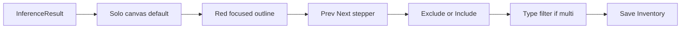
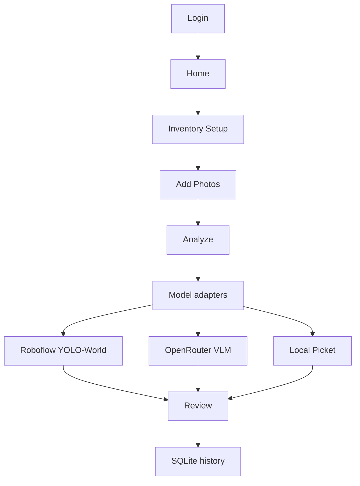
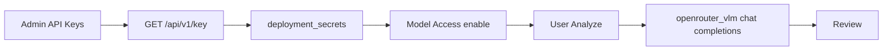
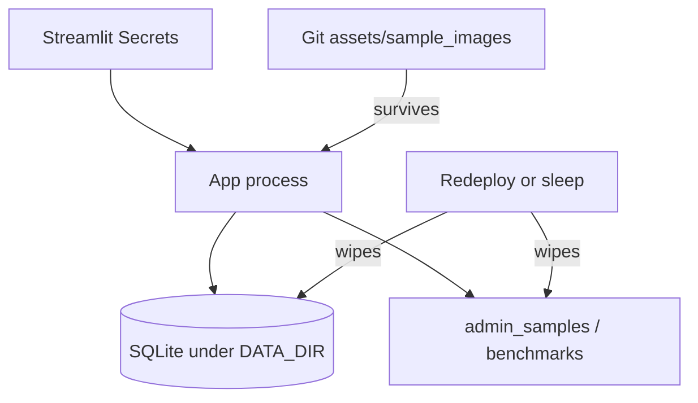

# AI Inventory Counter — Complete Application Overview

**Source of truth:** repository `main` at documentation refresh time.
**Maturity:** Proof of Concept — not production-ready.
**Related index:** [`DOCUMENTATION_INDEX.md`](DOCUMENTATION_INDEX.md)

This document is the detailed factual description of what the application
**currently does**. Prefer it over older narrative docs when they disagree.

---

## 3A. Executive summary

**AI Inventory Counter** is a Streamlit proof-of-concept that helps fence-rental
and similar yards draft **visible-object counts from photographs**. A person
chooses inventory, adds photos, runs AI (or local classical) detection, reviews
numbered markers, then saves a private history record.

| Topic | Fact |
|-------|------|
| What it solves | Manual photo counting is slow and hard to audit |
| What it demonstrates | End-to-end assistive count → human review → save |
| Who can use it | Signed-in `user` and `admin` accounts |
| What it is not | A production inventory system, accuracy SLA, or billing platform |
| Human review | **Required** before treating counts as official |

Closely stacked, occluded, distant, or overlapping objects may be missed.
Prompt wording and confidence thresholds strongly affect results.

---

## 3B. Main user journeys

| Journey | Starts | Who | Config | Produces | Cost | Limits |
|---------|--------|-----|--------|----------|------|--------|
| Sign in | Login page | Anyone with an account | Bootstrap or approved user | Session | Free | Lockout after 5 failures |
| Create an account | Login expander | Public | None | Pending user row | Free | Needs admin approve |
| Forgot password | Login expander | Existing user | None | Reset request | Free | Admin authorizes temp password |
| Forced password change | After admin-created login / reset | Flagged users | Temp password | New hash + session bump | Free | Blocks all other UI |
| Home dashboard | Post-login (all roles) | All signed-in | — | Navigation only | Free | — |
| Get Started wizard | Home | All signed-in | Inventory + photos + model | Analysis → review → save | Roboflow / OpenRouter when live | Ephemeral Cloud DB |
| Preset inventory | Setup stage | All signed-in | Profile prompts | One primary type; synonyms internal | — | Quality varies by photo |
| Custom Item (multi) | Setup | All signed-in | Item list + optional synonyms | One scan for all types | Same as model | Review filters by type |
| Upload / camera / samples | Photos stage | All signed-in | Size/format limits | Session image bytes | Free | Not permanently stored |
| Single / Compare Models | Analyze | All signed-in | Compatible validated models | InferenceResult(s) | Paid if remote | Compare needs ≥2 peers |
| Review & Save | After analysis | All signed-in | — | Reviewed count + SQLite row | Free | Solo red focus; Exclude |
| Inventory History | Sidebar | Own rows only | — | Table + CSV | Free | Cloud wipe possible |
| Detection Benchmark | AI Configuration tab | All signed-in | Live key for YOLO-World | `data/benchmarks*.json` | Paid when live | Ephemeral on Cloud |
| OpenRouter key | Sidebar **API Keys** | **Admin only** | OpenRouter `sk-or-…` | `deployment_secrets` | Verify free; runs bill admin | Ephemeral DB |
| Admin console | Sidebar Administration | Admin | — | Users, samples, policies, audit | Free / opt-in connectivity | Final-admin protection |
| Shape Detection | Sidebar icon (WIP) | All signed-in | None (local OpenCV) | Optional shape history | CPU only | Experimental accuracy |

---

## 3C. Authentication and accounts

- **Login-first:** no dashboard, wizard, or models until signed in.
- **Roles:** `user`, `admin`.
- **Account creation paths:**
  1. Bootstrap (env/secrets) while `users` is empty
  2. Admin console **Create a user** (temp password, forced change)
  3. Self-signup (**Create an account**) → `pending` until admin Approve/Reject
- **Password resets:** user requests via **Forgot password?**; admin Authorize/Reject.
- **Hashing:** Argon2id (`argon2-cffi`). Complexity **disabled** — any non-empty password.
- **Lockout:** 5 failed attempts → 15 minutes; admin Unlock.
- **Sessions:** idle 30 minutes / absolute 12 hours (env-overridable); `session_version` invalidates other sessions on password change/reset.
- **Landing:** everyone opens **Home** (`welcome`), including administrators.
- **Not implemented:** SSO/OIDC, MFA, email delivery, encryption at rest.

Bootstrap placeholders (never commit real values):

```toml
BOOTSTRAP_ADMIN_USERNAME = "admin"
BOOTSTRAP_ADMIN_PASSWORD = "choose_a_real_password"
BOOTSTRAP_ADMIN_EMAIL = "admin@example.com"
```

On Streamlit Community Cloud the SQLite database is **ephemeral**. Redeploy/restart
wipes accounts; bootstrap secrets must remain set so the first admin can be
recreated. Warning when users are empty and bootstrap vars missing:

> No administrator exists yet. Set BOOTSTRAP_ADMIN_USERNAME and
> BOOTSTRAP_ADMIN_PASSWORD in your environment or Streamlit secrets, then reload.

Authoritative detail: [`AUTHENTICATION_AND_ROLES.md`](AUTHENTICATION_AND_ROLES.md).

---

## 3D. Dashboard and navigation

### Unauthenticated

Product title, short description, Sign in, **Create an account**, **Forgot password?**.

### Signed-in Home

- **Get Started** → inventory wizard
- Capabilities list and recent saves (own history)
- **No** Try a Sample CTA on Home (samples live under Add Photos)
- **No** Shape Detection on Home

### Left sidebar icons

| Icon | Destination | User | Admin |
|------|-------------|------|-------|
| Home | Welcome | ✓ | ✓ |
| Administration | Admin console | | ✓ |
| Inventory History | History panel | ✓ | ✓ |
| AI Configuration | Catalog / benchmark / advanced | ✓ | ✓ |
| Diagnostics | Runtime health | ✓ | ✓ |
| Shape Detection · Work in progress | Shape page | ✓ | ✓ |
| API Keys | OpenRouter deployment key | | ✓ |
| Profile | Account / password | ✓ | ✓ |
| Sign out | Clears session | ✓ | ✓ |
| Theme toggle | Light / dark | ✓ | ✓ |

---

## 3E. Inventory selection

Profiles in `inventory_profiles.json` (all currently `enabled: true`):

Fence Panel · Pallets · Boxes · Poles · Gates · Chairs · Traffic Cones · Custom Item

- Presets: **one primary type**; synonym `prompt_terms` sent to the model internally.
- Custom Item: each listed item is a primary type; optional `item: alias1, alias2` synonyms.
- Multi-type Custom: **one inference scan** with all classes; Review switches type focus.
- Profile promotion/backups used by Detection Benchmark (atomic write + local backups).

---

## 3F. Image input

| Source | Notes |
|--------|--------|
| Upload | JPG/JPEG/PNG; `MAX_UPLOAD_BYTES` (default 25 MB) |
| Camera | Preview then add |
| Built-in samples | `assets/sample_images/` + `manifest.json` (git-tracked) |
| Admin samples | `DATA_DIR/admin_samples/` + `admin_samples` table (ephemeral on Cloud) |

Selecting a sample **does not** auto-run inference. Uploads live in session memory for
the run; photo bytes are **not** stored with history rows. Corrupt files are rejected.

---

## 3G. Detection models (registry)

| Display name | Kind | Enabled | Path | Dynamic prompts | Notes |
|--------------|------|---------|------|-----------------|-------|
| YOLO-World | workflow | Yes (default) | Roboflow Workflow + class_names injection | Yes | Primary live OD |
| Local Picket Counter | local | Yes | Classical NumPy/PIL | No | Fence Panel peer |
| OpenRouter VLM Detector | workflow\* | Yes in registry; policy seeds **disabled** | Direct OpenRouter chat/completions | Yes | Needs admin key + Model Access enable |
| Demo Fence Detector | model | No | Mock | — | Demo-only fixture |

\*Registry `kind`/`workflow_id` identify the catalog entry; Analyze uses adapter
`openrouter_vlm_detector` (direct HTTP), not Roboflow Workflow execution.

Statuses elsewhere: Metadata only · Live validated · Enabled · Stale · Unsupported.

---

## 3H. YOLO-World

1. Inventory prompts → `class_names` list
2. Fetch published workflow specification
3. Inject prompts into YOLO-World steps
4. `run_workflow(specification=…)` — no silent fallback to hardcoded fence defaults when dynamic prompts were requested
5. Normalize boxes → annotate → Review

Thresholds (default ~0.25) affect recall/precision. May box a whole structure as one object.

---

## 3I. OpenRouter (administrator-managed key)

> Filename [`OPENROUTER_BYOK.md`](OPENROUTER_BYOK.md) is historical. Runtime is **not** per-user BYOK.

| Topic | Behavior |
|-------|----------|
| Who enters the key | Administrators only (**API Keys**) |
| Storage | SQLite `deployment_secrets` (survives admin logout; wiped with Cloud DB) |
| Verification | Free `GET https://openrouter.ai/api/v1/key` — does not run a model |
| Inference | Direct `/api/v1/chat/completions` via `openrouter_vlm.py` |
| Users | Never see or paste the key |
| Cost notice | Per-user cost acknowledgement **not** required for Analyze |
| Quotas | Default seed 25 runs/user/UTC day; model starts disabled until admin enables |
| Catalog Test | May still show a paid-inference acknowledgement checkbox for that probe |

Legacy session key fields are cleared on logout for cleanup only.

---

## 3J. Model Catalog

Settings → **AI Configuration** → Model Catalog tabs: Foundation · My Workspace · Public Models.

- Refresh discovers workspace OD versions as **Metadata only** until live Test → Ready
- Fixed-class models need inventory class mapping; Custom Item stays on dynamic models
- Discovery ≠ validation

---

## 3K. Single Model and Compare Models

- Single: one compatible validated model → Run Analysis
- Compare: 2–3 peers; independent runs; failures isolated (`—`, not fake zero)
- Review: tabs / optional side-by-side; **Use This Result** — never auto-picks highest count
- Save embeds comparison metadata in `AIC_META` when present

---

## 3L. Review and count correction



- Styles: Numbered Markers · Boxes · Both · Roboflow Labels (local re-annotate)
- Dense scenes (≥12): hide stacked class chips except focus
- Filters: All / Included / Excluded / Warnings / Manual
- Manual markers via typed X/Y; adjustments for FP / missed / direct count
- Human review remains mandatory

---

## 3M. History

| Store | Scope | Cloud durable? |
|-------|-------|----------------|
| Inventory History | Per `user_id` only | No (ephemeral DB) |
| Benchmark History | Local JSON under `DATA_DIR` | No |
| Shape Test History | Per-user shape tables | No |

Administrators do **not** see other users’ inventory rows. Legacy unowned rows stay unshared. CSV export available. Images are not reattached to history.

---

## 3N. Detection Benchmark

AI Configuration → **Detection Benchmark**.

- Single Image and Batch modes
- Prompt sets, expected counts, threshold sweep
- Visual TP/FP labeling; precision / recall / count error for **that image**
- Cache + session export; optional profile promotion with backup
- Image-specific metrics ≠ universal model accuracy

---

## 3O. Shape Detection (implemented — WIP)

- Left sidebar icon; **Work in progress**
- Open to **all signed-in** users
- Local OpenCV (`opencv-python-headless`); no Roboflow/OpenRouter
- Multi-shape registry; solo/all review; optional save to shape history
- Experimental Features admin tab may still note save/history policy; it does **not** hide the sidebar entry

---

## 3P. Administrator Console (8 tabs)

Overview · Users · Samples · Model Access · Experimental Features · Connectivity · Audit Log · Storage and System

Users tab includes pending sign-ups and password-reset requests; create/reset/unlock/delete with final-admin protection; one-time temporary passwords.

Samples: validated upload to `DATA_DIR/admin_samples/`.

Model Access: enable/disable, roles, daily quotas (OpenRouter seeds disabled, quota 25).

---

## 3Q. Connectivity and diagnostics

- Connectivity: Roboflow/OpenRouter configuration state; opt-in Roboflow live test
- API Keys: admin OpenRouter verify/save/remove
- Diagnostics panel: runtime health, sanitized viewers
- Zero detections ≠ failures

---

## 3R–3S. Data storage and schema (v8)

| Data | Storage | Secrets? | Cloud persistent? |
|------|---------|----------|-------------------|
| Users / audit / policies / usage | SQLite | Password hashes only | No |
| Inventory counts | SQLite | No | No |
| Admin OpenRouter key | `deployment_secrets` | Yes | No |
| Admin samples | Files + table | No | No |
| Shape runs/items | SQLite | No | No |
| Signup / reset requests | SQLite | No | No |
| Model catalog cache | `data/model_catalog.json` | No | No |
| Benchmarks | `data/benchmarks*.json` | No | No |
| Built-in samples | Git `assets/sample_images/` | No | Yes (in git) |
| Wizard uploads | Session memory | No | No |
| Legacy session OR fields | Session (cleared) | Possibly | No |

Migrations 1–8: inventory → auth → ownership → model policies → admin samples → deployment secrets → shape/feature policies → signup/reset.

---

## 3T. Session state (categories)

Authentication · wizard form/photos/results · review edits · inference cache · comparison · benchmark · admin notices · shape detection · UI theme.

Cleared on logout / timeout / session invalidation (identity, wizard, cache, leftover BYOK fields, admin UI state).

---

## 3U. Security model

Protections: Argon2id, lockout, dual-layer admin gating, query-scoped history, redaction, upload validation, final-admin protection, audit log.

Gaps: no MFA/SSO, no encryption at rest, ephemeral Cloud storage, no spend reconciliation, no email, password complexity off.

See [`SECURITY_MODEL.md`](SECURITY_MODEL.md).

---

## 3V. External services and costs

| Service | Purpose | Credentials | When | Cost |
|---------|---------|-------------|------|------|
| Roboflow | YOLO-World / workspace | Deployment `ROBOFLOW_API_KEY` | Live analysis / catalog | Workflow credits |
| OpenRouter | VLM detector | Admin deployment key | Enabled model runs | OpenRouter billing |
| Local OpenCV / picket | Shape / pickets | None | Local CPU | Free |
| Streamlit Cloud | Hosting | Secrets UI | Always | Platform plan |

OpenRouter **verification** does not run a model. Demo Mode uses mocks and skips live Roboflow.

---

## 3W. Deployment

- Python **3.11**, entrypoint `app.py`
- `requirements.txt` + `packages.txt` (`libgl1`)
- Secrets: Roboflow + bootstrap (+ optional OpenRouter toggles)
- Health: `/_stcore/health` → `ok`
- Cloud reboot → empty DB → re-bootstrap

See [`STREAMLIT_DEPLOYMENT.md`](STREAMLIT_DEPLOYMENT.md).

---

## 3X. Testing

Offline pytest covers auth, signup/reset, admin console, review, OpenRouter VLM contracts, shape detection, catalog, compare, benchmarks helpers, redaction, migrations.

Paid live inference is intentional manual/`validate_live.py` work — not asserted Passed without evidence.

Offline suite at documentation refresh: **463 passed** (`pytest -q`). Re-run locally after changes; do not treat older counts as authoritative.

---

## 3Y. Known limitations

POC accuracy · occlusion/stacking · threshold sensitivity · ephemeral Cloud storage · admin-only OpenRouter key on ephemeral DB · no MFA/SSO · OpenRouter model disabled until admin enables · Shape Detection WIP false positives · no Cardboard Boxes built-in sample · Compare unavailable with one peer.

---

## 3Z. Future roadmap

See [`../POC_ROADMAP.md`](../POC_ROADMAP.md): durable PostgreSQL/object storage, OIDC/SSO/MFA, more live-validated models, monitoring, cost reconciliation.

---

## Architecture diagrams

### Main inventory flow



### OpenRouter admin-key flow



### Ephemeral Cloud storage



---

## Configuration reference (supported variables)

| Name | Required | Secret | Purpose | If missing |
|------|----------|--------|---------|------------|
| `ROBOFLOW_API_KEY` | For live Roboflow | Yes | YOLO-World / catalog | Live Roboflow fails; Demo Mode OK |
| `ROBOFLOW_WORKSPACE` | Optional | No | Default workspace | Registry defaults |
| `ROBOFLOW_WORKFLOW_ID` | Optional | No | Default workflow | Registry defaults |
| `DEMO_MODE` | Optional | No | Mock detections | Defaults false |
| `DATA_DIR` | Optional | No | Runtime DB/files | `./data` |
| `BOOTSTRAP_ADMIN_USERNAME` | For empty DB | Soft | First admin | Warning; no users |
| `BOOTSTRAP_ADMIN_PASSWORD` | For empty DB | Yes | First admin password | Warning; no users |
| `BOOTSTRAP_ADMIN_EMAIL` | Optional | No | Bootstrap email | Empty |
| `SESSION_IDLE_TIMEOUT_MINUTES` | Optional | No | Idle logout | 30 |
| `SESSION_ABSOLUTE_TIMEOUT_HOURS` | Optional | No | Hard logout | 12 |
| `OPENROUTER_MODELS_ENABLED` | Optional | No | Hide OpenRouter globally | true |
| `OPENROUTER_MODEL_ID` | Optional | No | VLM model id | config default |
| `OPENROUTER_KEY_VERIFY_URL` | Optional | No | Key metadata URL | OpenRouter default |
| `MAX_UPLOAD_BYTES` | Optional | No | Upload cap | 25 MB |
| `MAX_INFERENCE_DIMENSION` | Optional | No | Resize max side | 2048 |

See `.env.example` for the full commented list.
