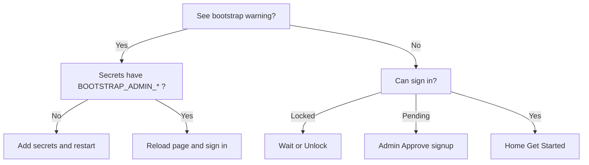

# Troubleshooting

Safe checks only — never paste API keys or passwords into logs, tickets, or chat.

---

## No administrator / bootstrap warning

**Symptom:**
`No administrator exists yet. Set BOOTSTRAP_ADMIN_USERNAME and BOOTSTRAP_ADMIN_PASSWORD…`

**Likely causes:** Empty `users` table (Cloud wipe) and missing bootstrap secrets.

**Fix:**

1. Streamlit → **App → Settings → Secrets** (or local `.env`).
2. Set placeholders with real values:

```toml
BOOTSTRAP_ADMIN_USERNAME = "admin"
BOOTSTRAP_ADMIN_PASSWORD = "choose_a_real_password"
BOOTSTRAP_ADMIN_EMAIL = "admin@example.com"
```

3. Save (restarts app) and reload.
4. Sign in with that username/password.

**Data-loss note:** Cloud restart already wiped prior accounts/history.

---

## Secrets not detected

**Symptom:** Demo Mode or missing Roboflow despite Secrets UI values.

**Checks:** TOML quoting; key names exact; app restarted after Secrets save; local `.env` present if not on Cloud.

---

## Login lockout

**Symptom:** “Too many failed attempts…”

**Fix:** Wait 15 minutes or have an admin **Users → Unlock**.

---

## Disabled or pending account

**Symptom:** Generic invalid credentials or waiting-for-approval message.

**Fix:** Admin Activate / Approve signup. Do not probe usernames publicly.

---

## Forced password change loop

**Symptom:** Cannot reach Home after admin-created login.

**Fix:** Complete **Update password** with current temp password + new non-empty password.

---

## Streamlit database reset

**Symptom:** Users, history, OpenRouter key, admin samples gone after redeploy.

**Cause:** Ephemeral filesystem. Re-bootstrap admin; re-enter OpenRouter key; re-create users/samples. Export CSV before planned redeploys.

---

## Roboflow authentication failure

**Symptom:** Connection / analysis errors mentioning auth.

**Checks:** `ROBOFLOW_API_KEY` in Secrets; not Demo Mode when expecting live; workspace/workflow IDs match registry; never log the raw key.

---

## No compatible model

**Symptom:** Analyze empty or Compare disabled.

**Checks:** Inventory compatibility; model Enabled + live-validated; `DEMO_MODE=false` hides demo fixtures; OpenRouter enabled under Model Access and admin key present.

---

## Successful zero detections

**Symptom:** Run succeeds with count 0.

**Meaning:** Valid empty prediction — not a crash. Adjust photo, prompts, or confidence threshold; Review still available.

---

## Dynamic prompt / injection failure

**Symptom:** Error about prompts not applied / injection failed.

**Checks:** Model supports prompts; Roboflow Management API reachable; published workflow still has YOLO-World steps; fail-closed (no silent fence fallback).

---

## OpenRouter key verifies but model unavailable

**Checks:**

1. Admin **API Keys** shows verified deployment key.
2. **Model Access** → OpenRouter VLM Detector **Enabled**.
3. `OPENROUTER_MODELS_ENABLED` not false.
4. Daily quota not exhausted.
5. Inventory compatible with dynamic detector.

Verification (`GET /api/v1/key`) never proves inference will succeed.

---

## OpenRouter inference errors

**Symptom:** Analyze fails after model enabled.

**Checks:** Admin key still valid; OpenRouter account billing; model id (`OPENROUTER_MODEL_ID`); Diagnostics / technical details (redacted). Path is **direct VLM**, not Roboflow Workflow predictions parsing.

---

## Compare Models unavailable

**Cause:** Fewer than two enabled, live-validated, inventory-compatible peers.

**Fix:** Validate/enable a second model (e.g. Local Picket for Fence Panel) or stay on Single Model.

---

## Local history / samples disappeared

**Cause:** Cloud ephemeral storage or local `DATA_DIR` deleted.

**Fix:** Re-run analysis; use git-tracked built-in samples; export CSV before resets.

---

## Shape Detection issues

**Symptom:** Unexpected shapes / false positives.

**Notes:** WIP local OpenCV; open from **left sidebar** (not Home); available to all signed-in users; no API key. Review before trusting counts.

---

## argon2 import / cannot sign in

**Symptom:** Password hashing errors at login.

**Fix:** Ensure `argon2-cffi` installed from `requirements.txt`; redeploy cleanly.

---

## Decision tree (bootstrap)


